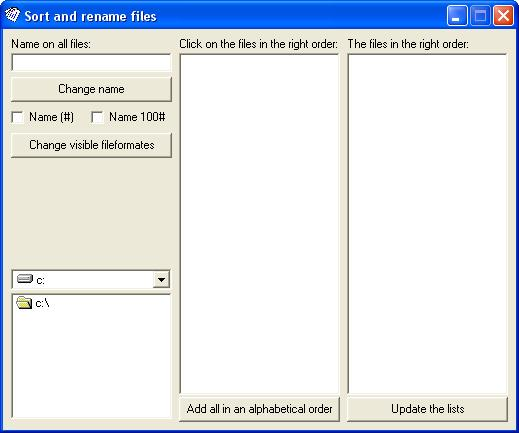



## Sort and rename files

### Description

With this program you can sort and rename multiple files and give them a filename like this: "Name 1" - "Name 2" - "Name 3" - and so on.
 
### More Info
 
A new name to the multiple files.

A new name on the multiple files.

Uses a lot of the CPU.

             |
---                |---
**Submitted On**   |2004-12-06 17:48:02
**By**             |[Niclas Hemberg](https://github.com/Planet-Source-Code/PSCIndex/blob/master/ByAuthor/niclas-hemberg.md)
**Level**          |Advanced
**User Rating**    |5.0 (10 globes from 2 users)
**Compatibility**  |VB 6\.0
**Category**       |[Complete Applications](https://github.com/Planet-Source-Code/PSCIndex/blob/master/ByCategory/complete-applications__1-27.md)
**World**          |[Visual Basic](https://github.com/Planet-Source-Code/PSCIndex/blob/master/ByWorld/visual-basic.md)
**Archive File**   |[Sort\_and\_r1826321262004\.zip](https://github.com/Planet-Source-Code/niclas-hemberg-sort-and-rename-files__1-57581/archive/master.zip)

